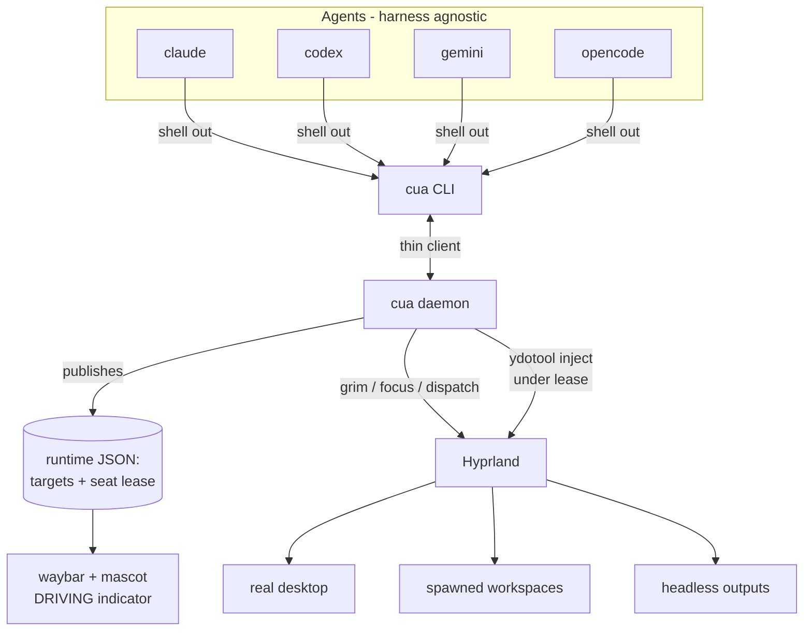

# Multi-Agent Computer-Use (CUA) Capability — Requirements

## Summary

Give the AI agents on the thinkpad a full computer-use loop — see and act on
the Wayland desktop — exposed the same harness-agnostic way the existing
`agent-status` daemon is. A `cua` CLI backed by a user daemon lets any of the
four agents (claude, codex, gemini, opencode) perceive and drive a target:
their own spawned workspace/headless output, or the user's real desktop behind
a push-to-grant safety gate. The serialized single-seat backend is built first;
true parallel isolation (nested compositors) and a text/a11y perception
fallback are declared targets behind the same CLI, built later.

## Problem Frame

Today an agent can *see* the desktop only by chance — in Claude Code it can run
`grim` and read the PNG, but codex/gemini/opencode may not run a shell freely or
read images inline, and none of them do it on their own. The concrete pain is
perception: explaining a UX issue (waybar alignment, hyprlock layout, a mascot
sprite) means describing pixels in prose instead of showing the agent the
screen. Acting is worse — there is no input-injection tool installed at all
(only `hyprctl`), so an agent cannot click, drag, or type into any GUI app.

The environment already runs several agents at once (the `agent-status` daemon
tracks parallel sessions per working directory). That makes the hard part not
"can one agent act" but "how do many agents share one physical desktop without
fighting over the single cursor or hijacking the screen the user is working on."

## Key Decisions

- **Harness-agnostic CLI + daemon, not a per-harness MCP server.** The `cua`
  CLI is the single entry point every agent shells out to; codex/gemini/opencode
  get the capability identically with no per-harness wiring. This mirrors the
  `agent-status` pattern (`home/linux/agent-status.nix`) the machine already
  uses and trusts.
- **Serialized single seat now; parallelism deferred.** Hyprland exposes one
  seat (one cursor, one keyboard). All action is serialized through a single
  seat lease in the daemon. Genuine simultaneous action is the *only* thing
  per-agent nested compositors buy, so that isolation is the deferred path — not
  built until real two-agents-acting-at-once contention appears.
- **Real-desktop control is push-to-grant with an always-on panic key.** An
  agent never takes the user's live seat unannounced. The user grants
  explicitly; a per-handoff lockout is available for delicate flows; a panic
  keybind reclaims the seat in one keystroke. Self-serve leases (acquire without
  a grant) are confined to sandbox targets, never the real desktop.
- **Pixels-first perception; a11y tree deferred.** `cua see` returns a
  screenshot now (works for Claude and any image-capable harness). A
  text/accessibility dump (`cua see --tree`) for image-blind harnesses is a
  declared-but-unbuilt capability behind the same verb.
- **Reuse existing surfaces.** Lease/driving state publishes to a JSON file
  under `$XDG_RUNTIME_DIR` like `agent-status.json`, and the DRIVING indicator
  reuses the waybar agent module and the lock-screen mascot rather than adding
  new UI.

## Actors

- A1. **User** — owns the machine and the real seat. Grants and revokes
  real-desktop control; can panic-reclaim at any time.
- A2. **Agent** (claude / codex / gemini / opencode) — invokes `cua`, perceives
  a target, requests and holds the seat to act.
- A3. **cua daemon** — owns the target registry and the single seat lease,
  serializes action, restores focus, and publishes live state.
- A4. **Hyprland** — provides outputs, workspaces, and the one seat; receives
  focus/output/dispatch commands and input injection.

## Requirements

**Harness-agnostic interface**

- R1. A `cua` CLI is the single entry point; any of the four agents invokes it
  by shelling out — no per-harness plugin or MCP server.
- R2. A user-level daemon owns shared state (target registry + seat lease) and
  publishes it to a JSON file under `$XDG_RUNTIME_DIR`, mirroring the
  `agent-status` daemon. The CLI is a thin client over the daemon.
- R3. CLI verbs cover the full loop: `see`, `click`, `type`, `scroll`,
  `target` (new/list/select), `acquire`/`release`, `grant`/`revoke`, and a
  status query.

**Targets**

- R4. A target is one of: a Hyprland workspace, a Hyprland headless output, or
  the user's real desktop output. Every perception/action call names a target.
- R5. An agent can spawn its own workspace or headless-output target on demand
  and address it by id; spawning does not switch the user's active view.
- R6. The daemon resolves a named target to the concrete output/workspace and
  seat context for every call.

**Perception**

- R7. `cua see <target>` returns a PNG of that target via `grim`, scoped to the
  target's output/region.
- R8. Perception is read-only and never requires the seat lease — multiple
  agents may see concurrently, including the real desktop while the user works.

**Action and the single seat**

- R9. `cua click` / `type` / `scroll` inject input via `ydotool` (added by this
  work; see Dependencies).
- R10. The daemon serializes all action through one seat lease. An agent must
  hold the lease to act; other action requests queue.
- R11. To act on a target that is not currently focused, the daemon focuses it,
  injects, and restores the prior focus.

**Control model — real desktop**

- R12. The real-desktop seat is push-to-grant: an agent never acquires it
  unannounced. The user grants explicitly (`cua grant <agent>` or a keybind).
- R13. While an agent holds the real-desktop seat, a visible DRIVING indicator
  shows on the waybar agent module and the mascot.
- R14. A panic keybind immediately revokes any active lease and stops input
  injection, returning the seat to the user in one keystroke.
- R15. A grant may set per-handoff lockout: the user's own seat input is parked
  until the agent releases or the panic key fires.
- R16. Self-serve leases (acquire without an explicit grant) are permitted only
  on sandbox targets (spawned workspaces / headless outputs), never the real
  desktop.

## Key Flows

- F1. **See my screen (UX feedback)**
  - **Trigger:** User asks an agent to look at the real desktop.
  - **Actors:** A1, A2, A3
  - **Steps:** Agent calls `cua see real`; daemon grabs the real output via
    `grim`; PNG returns. No lease taken; the user keeps working.
  - **Covered by:** R7, R8

- F2. **Agent acts in its own sandbox**
  - **Trigger:** Agent has a GUI task to perform off the user's screen.
  - **Actors:** A2, A3, A4
  - **Steps:** Agent spawns a workspace/headless target; self-serve-acquires the
    lease (allowed on sandboxes); daemon focuses the target; agent
    sees → clicks/types → sees; agent releases.
  - **Covered by:** R5, R9, R10, R11, R16

- F3. **Agent drives the real desktop**
  - **Trigger:** Agent needs to act on what the user is looking at.
  - **Actors:** A1, A2, A3
  - **Steps:** Agent requests real-desktop control; user grants (optionally with
    lockout); DRIVING indicator shows; agent acts under the lease; user hits the
    panic key or the agent releases.
  - **Covered by:** R12, R13, R14, R15

## Acceptance Examples

- AE1. **Covers R12, R16.** An agent calls `cua acquire real` without a prior
  grant. **Then** the request is denied (or queued pending grant), the seat does
  not move, and no input is injected.
- AE2. **Covers R8.** Two agents call `cua see real` while the user types in an
  editor. **Then** both receive a screenshot and the user's input is
  uninterrupted.
- AE3. **Covers R14.** An agent holds the real-desktop seat and is mid-action;
  the user presses the panic keybind. **Then** input injection stops within one
  keystroke, the lease is revoked, and the DRIVING indicator clears.
- AE4. **Covers R15.** A grant sets lockout and the agent is driving. **Then**
  the user's own cursor/keyboard input is parked until release or panic — the
  two input streams never interleave.
- AE5. **Covers R5, R11.** An agent spawns a headless-output target and acts on
  it while the user is on workspace 1. **Then** the user's active view does not
  switch and the prior focus is restored after the action.

## Architecture (orientation)

## Scope Boundaries

**Deferred for later (declared behind the same CLI)**

- Nested per-agent compositors (Approach B) — each agent its own seat for
  genuine parallel action. Built only when serialized single-seat contention is
  a real problem.
- `cua see --tree` — text/accessibility perception for harnesses that cannot
  read screenshots.

**Outside this work's identity**

- macOS / darwin support — this capability is Hyprland/Wayland-specific.
- A bespoke GUI for control — control surfaces reuse waybar/mascot/keybinds.

## Dependencies / Assumptions

- **Input injection must be added.** No input-injection tool exists today
  (verified: only `hyprctl`; no ydotool/dotool/wlrctl). This work adds `ydotool`
  + a `ydotoold` user service with `uinput` access. (Verified present today:
  `grim`, `slurp`, `wtype`, `wl-clipboard`.)
- **Reuses the agent-status pattern.** Daemon shape, runtime-JSON publishing,
  and the waybar/mascot surfaces follow `home/linux/agent-status.nix`,
  `home/linux/waybar.nix`, and the lock-screen mascot.
- **Assumes Hyprland can create headless outputs and drive focus/workspace via
  IPC** as documented — to be confirmed against the installed Hyprland version
  during planning.
- **Declarative delivery.** Built as nix-config modules/scripts; activation is a
  normal rebuild, not an imperative change to the running system.

## Outstanding Questions

**Deferred to planning**

- Daemon implementation language and IPC mechanism (shell + socket vs. a small
  program), consistent with the `agent-status` daemon's approach.
- Whether typing uses `ydotool type` or the already-present `wtype`, and how
  each behaves under the focus-restore path (R11).
- GPU/memory cost of Hyprland headless outputs on the Radeon 680M, and any cap
  on concurrent sandbox targets.
- Seat-lease queue policy details (FIFO, priority, timeout) beyond the
  push-to-grant and panic guarantees fixed above.
