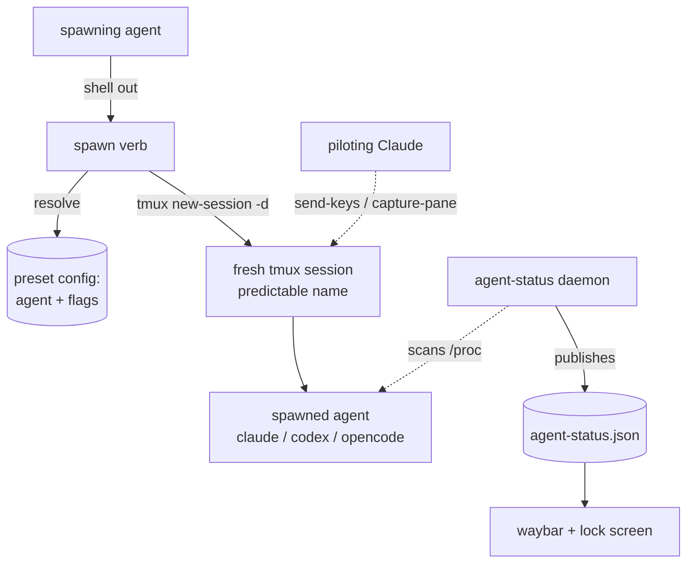

# Agent Spawn Presets — Requirements

## Summary

Add an easy way for an AI agent to spawn another agent session (claude / codex /
opencode) without looking up CLI flags. A `spawn` verb on the `agent-status`
feature takes a **named preset** that bundles the agent and its flags
(bypass-permissions included), launches it in its own detached tmux session, and
returns immediately with the session name. Presets are declared in the nix
config; spawned sessions surface in waybar and the lock screen automatically via
the existing daemon.

## Problem Frame

Spawning an agent today means opening a terminal and typing the right invocation
by hand — and the friction is the *flags*, not the launch. Each harness spells
"run without permission prompts" differently (claude
`--dangerously-skip-permissions`, codex and opencode each their own), so an agent
asked to "spawn a claude session" has to recall or look up per-harness
incantations it rarely uses. That lookup is exactly the kind of thing an agent
gets wrong or refuses to guess at.

The machine already runs several agents at once and already tracks them: the
`agent-status` daemon (`home/linux/agent-status-daemon.py`) scans `/proc` and
publishes who is running and what they last said. What is missing is the inverse
of observation — a one-command way to *start* a session with a known-good
configuration, so "spawn a claude in this directory" is a single legible verb
rather than a flag-recall exercise.

## Key Decisions

- **Presets over raw flag pass-through.** The spawn interface is preset-first: an
  agent names a configuration, never a flag string. The per-harness flags live
  declaratively in the nix config, in one place, so no agent has to know them.
- **A stateless verb over tmux, not a daemon that owns processes.** Spawning is a
  one-shot action layered onto the `agent-status` feature, not new resident
  state. The existing observer loop — capped at `CPUQuota=5%` / `MemoryMax=64M`
  and written to swallow every error — stays a passive watcher and keeps its
  fail-soft guarantees.
- **Bypass-permissions is the default; `-safe` is the explicit opt-out.** A
  fire-and-forget spawn cannot answer a permission prompt nobody is watching, so
  the default preset for each agent is the bypass-on one. The dangerous and safe
  variants are *named* (`claude-yolo` vs `claude-safe`) so the choice is legible
  rather than buried in flags.
- **Fire-and-forget; raw tmux is the control and recovery plane.** The spawner
  does not wait, capture output, or wrap session interaction. A Claude session
  can pilot a codex/gemini session — which lack the remote control a Claude
  session has — by driving its tmux target with `send-keys` / `capture-pane`.
  Predictable session naming is what makes that reliable, so naming is a
  first-class requirement rather than a wrapper.
- **Reuse the agent-status surfaces.** Spawned sessions are real processes, so
  the daemon detects them with no new wiring and they appear in waybar and the
  lock screen for free.

## Actors

- A1. **Spawning agent** — invokes `spawn`; the orchestrator handing off work.
- A2. **Spawned session** — a claude/codex/opencode instance launched into its
  own tmux session.
- A3. **User** — owns the machine; defines presets in the nix config; can
  `tmux attach` to any session.
- A4. **agent-status daemon** — passively detects spawned sessions and publishes
  status; never invoked by the spawn path.
- A5. **tmux** — hosts each session and is the addressing/control substrate.

## Requirements

**Spawn command**

- R1. A `spawn` verb is added to the `agent-status` feature; any agent invokes it
  by shelling out. It is stateless and does not modify or depend on the resident
  daemon loop.
- R2. `spawn <preset> [dir] [prompt]` launches the preset's agent in a fresh
  detached tmux session, returns immediately (fire-and-forget), and prints the
  tmux target name.
- R3. An optional initial prompt is passed through to the spawned agent so it
  begins on a handed-off task; omitted, the session is an empty interactive REPL.
- R4. The session's working directory is an explicit `dir` argument, defaulting
  to the caller's current directory.

**Presets**

- R5. A preset is a named configuration bundling one agent (claude / codex /
  opencode) with its CLI flags, plus optional extras (model, additional args).
  Presets are defined declaratively in the nix config.
- R6. Presets encode the per-harness bypass-permissions flag, so a spawning agent
  never supplies it directly. Bypass-on and safe variants are distinctly named.
- R7. Each agent has a default preset, used when only a bare agent name is given.
  The default is the bypass-on configuration; the `-safe` preset is the explicit
  non-bypass opt-out.
- R8. The set of available presets is discoverable by an agent at runtime without
  reading the nix source.

**tmux placement and addressability**

- R9. Each spawn lands in its own fresh detached tmux session, named predictably
  from agent and directory, so it is discoverable via `tmux ls` and addressable
  via `tmux send-keys` / `capture-pane`.
- R10. Session names are collision-safe: spawning the same preset in the same
  directory twice yields two distinct, individually addressable sessions.

**Integration with agent-status**

- R11. Spawned sessions are detected automatically by the daemon's existing
  session-root logic and appear in `agent-status`, the waybar pill, and the
  lock-screen roster with no additional wiring.

## Architecture (orientation)

## Key Flows

- F1. **Agent spawns a preset**
  - **Trigger:** User asks an agent to start another session (e.g. "spawn a
    claude in ~/web to refactor auth").
  - **Actors:** A1, A2, A5, A4
  - **Steps:** The agent runs `spawn claude ~/web "refactor auth"`; the verb
    resolves the preset to agent + flags, creates a fresh detached tmux session
    with a predictable name, launches the agent (bypass per the preset) seeded
    with the prompt, and prints the target name. The daemon picks up the new
    process within a tick.
  - **Covered by:** R2, R3, R5, R6, R9, R11

- F2. **Claude pilots a non-controllable session (recovery)**
  - **Trigger:** A spawned codex/gemini session is stuck on a prompt or needs
    steering, and cannot be driven through native remote control.
  - **Actors:** A1, A2, A5
  - **Steps:** A Claude resolves the target from `tmux ls` (names are
    predictable), reads its state with `capture-pane`, and answers or steers it
    with `send-keys` (or Ctrl-C). No wrapper verb is involved.
  - **Covered by:** R9, R10

## Acceptance Examples

- AE1. **Covers R7.** An agent runs `spawn claude` with no preset named. Then the
  default bypass-on preset launches a fresh tmux session, permissionless, with no
  flag lookup.
- AE2. **Covers R6, R7.** An agent runs `spawn claude-safe`. Then claude launches
  without the bypass flag and prompts for permissions as normal.
- AE3. **Covers R2, R3, R4.** An agent runs `spawn codex ~/web "run the tests"`.
  Then a fresh detached tmux session starts codex in `~/web` seeded with that
  prompt, and the command returns immediately printing the session name.
- AE4. **Covers R11.** A spawn completes. Then within a tick the new session
  appears in `agent-status`, the waybar pill, and the lock-screen roster, with no
  extra wiring.
- AE5. **Covers R10.** An agent spawns the same preset in the same directory
  twice. Then both sessions exist under distinct, addressable tmux names.

## Scope Boundaries

**Deferred for later**

- A gemini preset. The daemon already tracks gemini, so adding one is a config
  edit, not new mechanism — left out of the first cut per "codex, opencode,
  claude for now."
- A user-facing trigger (keybind or dashboard button). The primary surface is the
  agent-invoked CLI verb, which the user can also run directly.

**Out of scope**

- A wrapper interaction surface (send / read / list / kill). Raw tmux handles
  agent-to-agent communication and recovery.
- Automatic wait-for-completion or capture-into-context orchestration. The model
  is fire-and-forget by design.
- Session lifecycle and auto-cleanup. Dead tmux sessions are cleared manually
  (`tmux kill-session`).
- macOS / darwin. This is a Hyprland/Linux capability.

## Dependencies / Assumptions

- **Per-harness bypass flags must be confirmed.** claude's
  `--dangerously-skip-permissions` is known; the codex and opencode equivalents
  (and how each behaves unattended) are to be verified during planning before
  baking them into presets.
- **tmux is present and configured** via `home/common/tmux.nix` (verified).
- **The daemon will see spawned sessions as distinct roots.** `scan_procs()`
  collapses same-agent child processes into their session root; tmux daemonizes
  the spawned agent so it is parented by the tmux server, not the spawning agent,
  and should therefore appear as its own root. To confirm during planning that a
  tmux-launched same-agent session is not collapsed under its spawner.
- **Declarative delivery.** Presets and the spawn verb ship as nix-config
  (extending `home/linux/agent-status.nix` or a sibling module); activation is a
  normal rebuild.

## Outstanding Questions

**Deferred to planning**

- Exact bypass / auto-approve flags per harness (codex, opencode) and their
  unattended behavior.
- Whether `spawn` is a subcommand of the existing `agent-status` CLI or a sibling
  `agent-spawn` CLI.
- The preset definition shape in nix (the attrset schema) and how presets are
  exposed for agent discovery (a `spawn --list`, or generation into
  `/etc/agent-context.md`).
- The predictable-naming and collision scheme (suffix counter vs short id).
- How the default working directory is resolved when the spawning agent's own cwd
  differs from the intended target directory.
