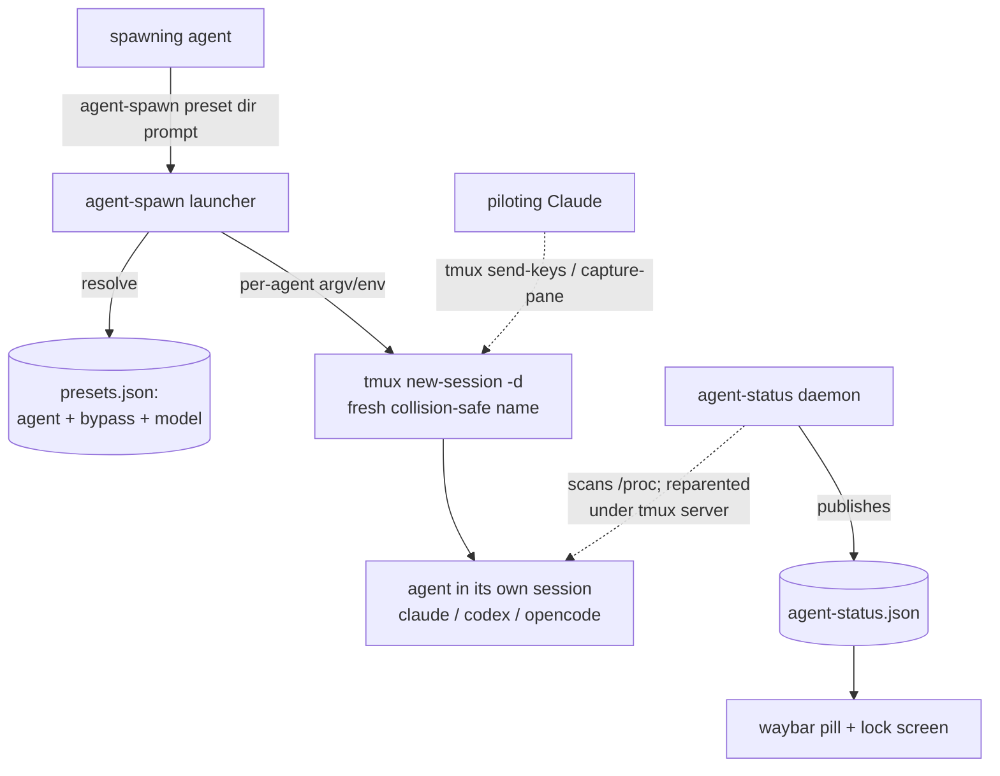

# feat: Agent spawn presets (agent-spawn CLI)

## Summary

Add an `agent-spawn` command to the agent-status feature so an agent can launch
another agent session (claude / codex / opencode) without knowing CLI flags.
`agent-spawn <preset> [dir] [prompt]` resolves a declarative preset to a
per-harness invocation, launches it in its own detached tmux session, and prints
the session name. Bypass-permissions is baked into presets; spawned sessions are
detected by the existing daemon and appear in waybar and the lock screen for
free.

---

## Problem Frame

Spawning an agent today means recalling the right per-harness invocation by hand,
and the friction is the flags, not the launch. Each harness spells "run without
permission prompts" differently, and the prompt-passing differs too — verified
against the installed binaries: claude takes `--dangerously-skip-permissions` +
a positional prompt; codex takes `--dangerously-bypass-approvals-and-sandbox` +
a positional prompt; opencode's TUI has no bypass flag at all (permission is env-
or config-driven) and seeds via `--prompt`. An agent asked to "spawn a claude in
this directory" should not have to know any of that. The machine already tracks
running agents via the agent-status daemon (`home/linux/agent-status-daemon.py`);
this adds the inverse — a one-command, preset-driven way to start one.

---

## Key Technical Decisions

- KTD1. Ship a sibling `agent-spawn` command, not a subcommand of the read-only
  `agent-status` query tool. Both live in `home/linux/agent-status.nix` (the
  module that owns the feature). The status tool stays a pure reader used by
  `watch`/scripts; spawning needs different runtime inputs (tmux + the agent
  binaries) and mutates state, so overloading the reader would muddy its
  contract. (see origin: outstanding question "subcommand vs sibling CLI")

- KTD2. Presets are declarative data; the per-agent invocation mapping lives in
  the launcher. A preset is `{ agent, bypass: bool, model? }`. A bare preset
  named after the agent (`claude`) is the bypass-on default; `<agent>-safe` is
  the explicit opt-out (R7). The per-harness bypass spelling and prompt placement
  are NOT in preset data — they live once in the launcher's per-agent dispatch.

- KTD3. Per-harness bypass and prompt mechanics are resolved and fixed (see
  High-Level Technical Design table). claude/codex use a bypass flag plus a
  positional prompt that auto-starts the session. opencode's attachable TUI has
  no bypass flag, so bypass is the `OPENCODE_PERMISSION='{"*":"allow"}'` env var
  (which also covers opencode's `external_directory`/`doom_loop` ask-defaults),
  and the prompt is `--prompt`. opencode is also the only harness whose seeded
  prompt may not auto-start: for opencode only, the launcher dispatches a
  detached, delayed `tmux send-keys … Enter` (guarded against double-submit if
  auto-submit does fire) so the parent still returns immediately, and R3 for
  opencode is verified against a funded model before being relied on.

- KTD4. One fresh detached tmux session per spawn, predictably and collision-
  safely named, kept alive after the agent exits via tmux-native `remain-on-exit`
  (not a shell wrapper). Predictable names make the session addressable for the
  tmux pilot/recovery path (R9, R10); `remain-on-exit` keeps the pane after the
  agent exits so a human or piloting Claude can still attach, without a wrapper
  that would complicate prompt quoting.

- KTD5. No daemon changes. Spawned agents reparent under the tmux server (not the
  spawning agent), so the daemon's existing session-root logic counts each as a
  distinct root and surfaces it with no new wiring. Verified empirically: a
  spawned opencode appeared in `agent-status` within one tick and cleared within
  one tick of being killed.

- KTD6. The launcher never interpolates the prompt or dir into a shell string. It
  invokes the agent as tmux command argv (`tmux new-session -d -s NAME -c DIR
  [-e VAR=val] -- <abs-agent-path> [flags] [prompt]`), with the prompt as a
  distinct trailing argument, and references each agent binary by absolute Nix
  store path (an input to the `writeShellApplication`). This closes a prompt-
  injection / word-splitting sink and removes any dependence on a possibly-stale
  PATH or env in an already-running tmux server. The module must take `unstable`
  to reference the claude-code package by store path.

---

## High-Level Technical Design

Per-harness invocation mapping (the data the launcher encodes; verified against
the installed CLIs and opencode source):

| harness | bypass (attachable session) | initial prompt | starts working |
|---|---|---|---|
| claude | `--dangerously-skip-permissions` (flag) | positional `[prompt]` | auto on launch |
| codex | `--dangerously-bypass-approvals-and-sandbox` (flag) | positional `[PROMPT]` | auto on launch |
| opencode | `OPENCODE_PERMISSION='{"*":"allow"}'` (env) | `--prompt "…"` | auto-submit when model ready; else `send-keys Enter` |

`-safe` presets omit the bypass mechanism for their harness (no flag for
claude/codex; no `OPENCODE_PERMISSION` for opencode). opencode then runs under
its default `build` agent, which allows tool use via its `*`-allow rule but still
prompts on the separate `external_directory`/`doom_loop` ask-defaults.

---

## Requirements

Carried from the origin requirements doc and traced to units below.

**Spawn command**

- R1. `agent-spawn` is added to the agent-status feature; any agent shells out to
  it. Stateless; no dependency on the resident daemon loop. (U1)
- R2. `agent-spawn <preset> [dir] [prompt]` launches the preset's agent in a fresh
  detached tmux session, returns immediately, and prints the tmux target name.
  (U2)
- R3. An optional initial prompt is passed through; omitted, the session is an
  empty interactive REPL. (U2)
- R4. Working directory is an explicit `dir` argument, defaulting to the caller's
  cwd. (U2)

**Presets**

- R5. A preset bundles one agent with its bypass setting and optional model,
  defined declaratively in nix. (U1)
- R6. A preset carries whether bypass is on (a `bypass` boolean); the per-harness
  bypass spelling lives once in the launcher, not in preset data. Bypass-on and
  `-safe` variants are distinctly named. (U1, U2)
- R7. Each agent's bare-named preset is the bypass-on default; `<agent>-safe` is
  the non-bypass opt-out. (U1)
- R8. Available presets are discoverable at runtime (`agent-spawn --list`) without
  reading the nix source. (U1, U3)

**tmux placement and addressability**

- R9. Each spawn lands in its own fresh detached tmux session, predictably named
  from agent + directory, discoverable via `tmux ls` and addressable via
  `send-keys` / `capture-pane`. (U2)
- R10. Names are collision-safe: the same preset in the same directory twice
  yields two distinct addressable sessions. (U2)

**Integration with agent-status**

- R11. Spawned sessions are detected automatically by the daemon and appear in
  `agent-status`, the waybar pill, and the lock-screen roster with no new wiring.
  (U2, verified empirically)

---

## Implementation Units

### U1. `agent-spawn` CLI scaffold and preset data

- Goal: A `writeShellApplication` named `agent-spawn` plus a declarative preset
  set, packaged alongside the `agent-status` CLI, with preset resolution and a
  `--list` discovery verb.
- Requirements: R1, R5, R6, R7, R8
- Dependencies: none
- Files: `home/linux/agent-status.nix` (add the `agent-spawn` app, a `presets`
  nix attrset, and a generated `presets.json` via `pkgs.writeText`; add to
  `home.packages`)
- Approach: Define presets as a nix attrset (`claude`, `claude-safe`, `codex`,
  `codex-safe`, `opencode`, `opencode-safe`), each `{ agent; bypass; model? }`.
  Render to JSON with `pkgs.writeText` (mirrors the generated-config pattern in
  `home/linux/ags.nix`). The script resolves `<preset>` to its agent/bypass via
  `jq` (mirrors the jq usage already pervasive in this module). Argument shape:
  `agent-spawn <preset> [dir] [prompt]`, plus `--list` (print presets + their
  agent/bypass) and `-h/--help`. Unknown preset or no args → usage on stderr,
  non-zero exit, no session created. `runtimeInputs` = `[ tmux jq coreutils ]`.
- Patterns to follow: the `agent-status` `writeShellApplication` in the same
  file (runtimeInputs, `case "$1"` dispatch, jq over a JSON source); generated
  config via `pkgs.writeText` as in `home/linux/ags.nix`.
- Test scenarios (runtime verification — no shell-tool test framework in this
  repo; the daemon ships the same way):
  - `agent-spawn --list` prints all six presets, each showing its agent and
    whether bypass is on. Covers R8.
  - `agent-spawn` with no args, and `agent-spawn bogus-preset`, print usage to
    stderr, exit non-zero, and create no tmux session.
  - `nixos-rebuild dry-build --flake ~/nix-config#thinkpad` succeeds with the new
    app and presets.
- Verification: the command exists on PATH after rebuild; `--list` enumerates
  presets sourced from the nix attrset.

### U2. tmux launch and per-agent invocation mapping

- Goal: Turn a resolved preset + dir + prompt into a running agent in a fresh,
  predictably-named, collision-safe detached tmux session that survives the
  agent's exit, and print the session name.
- Requirements: R2, R3, R4, R6, R9, R10, R11
- Dependencies: U1
- Files: `home/linux/agent-status.nix` (the launch body of the `agent-spawn` app)
- Approach: Build the per-agent invocation from the mapping table in High-Level
  Technical Design — claude/codex get their bypass flag (bypass-on presets) and
  the prompt as a trailing positional; opencode gets `--prompt <prompt>` plus
  `OPENCODE_PERMISSION={"*":"allow"}` injected via `tmux new-session -e`
  (bypass-on only). Apply `--model` when the preset sets one. Reference each agent
  binary by absolute Nix store path (a `writeShellApplication` input), not a bare
  name, so a stale PATH in an already-running tmux server can't break resolution.
  Compute a session name `agent-<harness>-<dir-basename>` (sanitized); if
  `tmux has-session` matches, append `-2`, `-3`, …. Create with
  `tmux new-session -d -s <name> -c <dir> [-e VAR=val] -- <abs-agent> <args…>`,
  passing the prompt and dir as distinct argv elements — never interpolated into
  an `sh -c` string — so they can't word-split or inject shell commands at spawn.
  Keep the pane after exit with tmux-native `remain-on-exit on` (no shell
  wrapper). For opencode only, dispatch a detached delayed
  `tmux send-keys -t <name> Enter` (guarded against double-submit) to start a
  seeded session if auto-submit doesn't fire. Print the session name; return
  immediately.
- Technical design (directional, not implementation spec): launch shape is
  `tmux new-session -d -s "$name" -c "$dir" [-e VAR=val] -- "$agent_abs" "$@"`
  with the prompt as the final argv element, followed by
  `tmux set-option -t "$name" remain-on-exit on`. No `sh -c` wrapper and no
  string interpolation of prompt/dir.
- Patterns to follow: jq + `case` dispatch from the `agent-status` CLI; the
  daemon's documented comm names (`.claude-wrapped`, `.codex-wrapped`,
  `.opencode-wrapp`) for understanding how the spawn is later detected.
- Test scenarios (runtime verification):
  - `agent-spawn claude /tmp` → a detached session named `agent-claude-tmp` with
    claude running under `--dangerously-skip-permissions`; the command prints the
    name and returns at once. Covers AE1, R2, R7, R9.
  - `agent-spawn claude-safe /tmp` → claude launched WITHOUT the bypass flag.
    Covers AE2, R6, R7.
  - `agent-spawn codex ~/some-dir "run the tests"` → detached session, codex in
    `~/some-dir` with the bypass flag, seeded with the prompt as one argument.
    Covers AE3, R3, R4.
  - `agent-spawn opencode /tmp "do X"` → session launched with
    `OPENCODE_PERMISSION` set and `--prompt "do X"`. Covers R6 (opencode shape).
  - `agent-spawn claude /tmp` run twice → second session is `agent-claude-tmp-2`,
    both attachable. Covers AE5, R10.
  - Within ~2s of any spawn, the session appears in `agent-status` and the waybar
    pill / lock-screen roster; after the agent process exits, the session persists
    as a shell and `tmux attach` shows it. Covers AE4, R11.
  - `tmux send-keys -t <name> …` into a spawned session reaches it (pilot/recovery
    path). Covers origin flow F2.
  - A prompt containing spaces and shell metacharacters (e.g. `say "$(whoami)"`)
    reaches the agent verbatim as one argument and is NOT shell-evaluated at spawn
    (no command substitution runs). Covers the injection-safety property of KTD6.
  - `agent-spawn claude /tmp` works when a tmux server is already running from a
    prior login shell — the agent binary resolves via its absolute store path, not
    the server's inherited PATH.
- Verification: each harness spawns into its own session with the correct bypass
  posture; names are unique under repeat; the daemon reflects spawn and exit.

### U3. Discoverability and docs

- Goal: Make `agent-spawn` discoverable to agents and document the capability.
- Requirements: R8
- Dependencies: U1, U2
- Files: `docs/agent-status.md` (add the spawn capability — presets, the
  per-harness table, the tmux pilot/recovery flow); `modules/nixos/agent-context.nix`
  (advertise `agent-spawn` in `/etc/agent-context.md` so non-Claude agents
  discover it)
- Approach: Extend the existing agent-status reference with an "Spawning agents"
  section covering preset names, the bypass-default / `-safe` convention, the
  per-harness mechanics, and how a Claude pilots other sessions via tmux. Add a
  one-line `agent-spawn` entry to the agent-context advertisement next to the
  existing agent-status entry.
- Patterns to follow: the existing structure of `docs/agent-status.md` and the
  daemon advertisement already in `modules/nixos/agent-context.nix`.
- Test expectation: none -- docs/context advertisement only; verified by reading
  the rendered `/etc/agent-context.md` and `docs/agent-status.md` after rebuild.
- Verification: `/etc/agent-context.md` names `agent-spawn`; the reference doc
  describes presets and the recovery flow.

---

## Acceptance Examples

Carried from origin; each links to the units and tests that satisfy it.

- AE1. `agent-spawn claude` with no preset suffix launches the bypass-on default
  preset — a fresh session, permissionless, no flag lookup. Covers R7. (U2)
- AE2. `agent-spawn claude-safe` launches claude without the bypass flag. Covers
  R6, R7. (U2)
- AE3. `agent-spawn codex <dir> "run the tests"` starts codex in `<dir>` seeded
  with the prompt and returns immediately with the session name. Covers R2, R3,
  R4. (U2)
- AE4. A completed spawn appears in `agent-status` / waybar / lock screen within a
  tick, with no extra wiring. Covers R11. (U2, verified empirically)
- AE5. The same preset in the same directory twice yields two distinct,
  addressable session names. Covers R10. (U2)

---

## Scope Boundaries

**Deferred for later** (from origin)

- A gemini preset. The daemon already tracks gemini, so adding one is a preset-
  data edit; left out of the first cut.
- A user-facing trigger (keybind or dashboard button). The agent-invoked CLI is
  the primary surface and the user can run it directly.

**Out of scope** (from origin)

- A wrapper interaction surface (send / read / list / kill). Raw tmux handles
  agent-to-agent communication and recovery.
- Automatic wait-for-completion or capture-into-context orchestration.
- Session lifecycle and auto-cleanup (`tmux kill-session` is manual).
- macOS / darwin. This is a Hyprland/Linux capability.

**Deferred to Follow-Up Work** (plan-local)

- A committed permissive opencode agent file (`~/.config/opencode/agents/…`) for a
  stricter "never prompt on anything" opencode preset. The `OPENCODE_PERMISSION`
  env approach already covers `external_directory`/`doom_loop` for the common
  case, so a dedicated agent file is a refinement, not a v1 need.
- Dedupe by reading `agent-status.json` before spawning. Collision handling via
  `tmux has-session` is sufficient for v1.

---

## Open Questions

Deferred to implementation:

- opencode prompt passthrough (R3): verify `--prompt` auto-submit against a funded
  model, and confirm the detached delayed `send-keys Enter` fallback (with double-
  submit guard) reliably starts a seeded session. opencode's default model is out
  of balance today, so this can't be exercised until a funded `--model` is used.
- Confirm `OPENCODE_PERMISSION={"*":"allow"}` actually suppresses prompts in the
  opencode TUI — it was never exercised live (the probe's model was out of
  balance, so opencode never ran a tool).
- Final session-naming scheme: sanitization of the directory basename (slashes,
  spaces, empties) and the collision-suffix format.

---

## Risks & Dependencies

- Bypass-on by default means spawned agents run permissionless. Intentional and
  brainstorm-confirmed for this single-user machine; mitigations are the named
  `-safe` presets and the legible preset names, plus the existing tmux pilot
  recovery and the cua panic key.
- codex's `--dangerously-bypass-approvals-and-sandbox` is documented as intended
  for externally-sandboxed environments; using it on the real machine is the
  explicit point of the bypass preset.
- tmux server environment: agent binaries are referenced by absolute Nix store
  path and per-spawn env is injected with `tmux -e`, so a stale PATH/env in an
  already-running tmux server no longer breaks resolution (KTD6). This requires
  the module to take `unstable` to reference the claude-code store path.
- `-safe` is a default-selection convenience, not a containment boundary. Any
  process running as the user — including a `-safe` agent — can invoke
  `agent-spawn` (or the bypass flags directly) to launch a permissionless sibling.
  Don't rely on `-safe` to confine untrusted code; it grants no capability a user
  shell lacked.
- opencode's default model (GLM-5 via Z.AI) is currently out of balance, so a
  spawned opencode will not actually run until recharged or a `--model` is passed.
  A user heads-up, not a feature blocker.
- The daemon counts opencode as two processes per instance (observed `count: 2`).
  Pre-existing detection nuance, not introduced here; spawned opencode inherits
  it. Out of scope to fix.

---

## Sources / Research

- Origin requirements: `docs/brainstorms/2026-06-28-agent-spawn-presets-requirements.md`
- Installed-CLI probes (authoritative for flags): `claude --help`,
  `codex --help`, `opencode --help`, `opencode run --help`, `opencode agent list`
  (showed the default `build` agent is `{permission:*, allow, *}`), and an empty
  `~/.config/opencode/opencode.jsonc`.
- opencode docs/source (via research): permission model (`permission` block;
  `OPENCODE_PERMISSION` env; `--dangerously-skip-permissions` is run-only),
  agents (`~/.config/opencode/agents/<name>.md`), and `--prompt` auto-submit.
  URLs: https://opencode.ai/docs/permissions/, /agents/, /cli/, /config/.
- Empirical tmux probe: opencode spawned in a detached tmux session reparents
  under the tmux server; the agent-status daemon detected it within a tick and
  cleared it within a tick of kill; `--prompt` pre-filled but did not submit under
  the out-of-balance model.
- Existing patterns: `home/linux/agent-status.nix` (`writeShellApplication` +
  systemd user service), `home/linux/agent-status-daemon.py` (`scan_procs`
  session-root logic + comm names), `home/common/tmux.nix`, `home/linux/ags.nix`
  (`pkgs.writeText` generated config).
